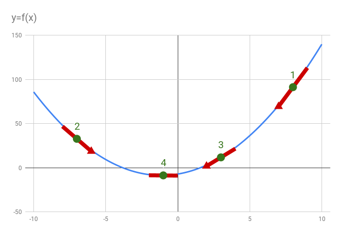

# Short theoretical introduction

## Finding minimum of a function using gradient descent

This algorithm is at the core of neural network training, so it is very important to understand it before
we move forward.

Let's say we have a function y = f(x) and for
that function we want to find value of parameter "x" for which the function value is minimal.

The algorithm is presented on following graph, where horizontal axis is "x" and vertical represents function value "y":

1. We start by assigning random value to "x", in our example this puts us in position (1).
2. In this point we check how the value of the function changes in nearest neighborhood of current "x" (marked red on the
chart). This information is provided by derivative of the function. Sign of the derivative tels us if the function value 
increases or decreases with increased value of "x". The absolute value of the derivative (slope of the read line) tells us
how fast the functions changes in near proximity of our current location on "x" axis.
3. The derivative in point (1) tells us we should move left and since the slope is quite steep, we take a large jump to point (2).
More technically speaking, we subtracted portion of the derivative from our current value of "x" (the derivative had a
positive value indicating that the function value increases with increased value of "x", but we want to find the minimum
so we are moving in the opposite direction)
4. In point (2) we again calculate the derivative and find out that we overdid and this time we need to move right.
Because slope is less steep, we move by smaller value than we did last time. Technically: derivative is now a negative
number so by subtracting it from our current "x" we will actually increase value of "x". This way we have moved to point
(3)
5. We repeat this procedure until our steps become very small. We arrived at point (4) where derivative is near or 
equal to zero. We have found the value of "x" for which the function value is minimal.
